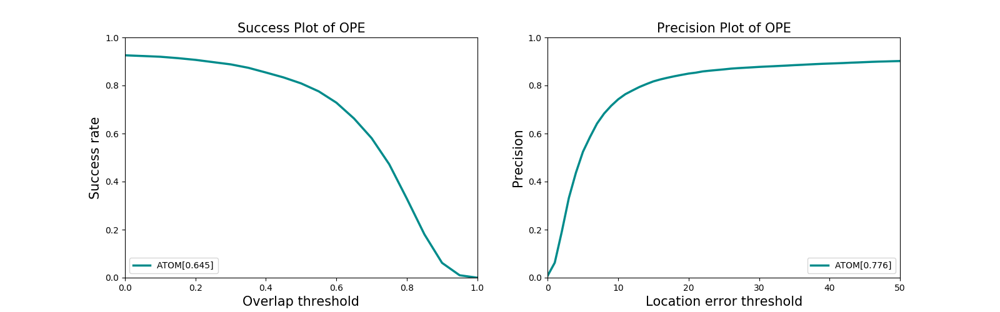
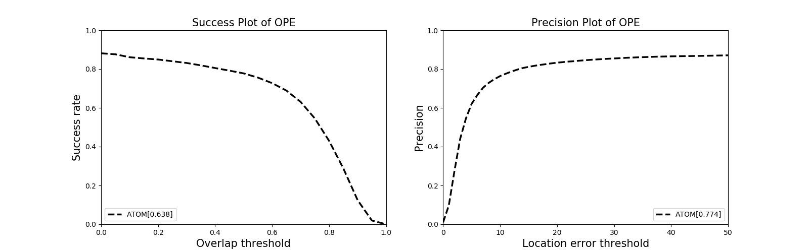
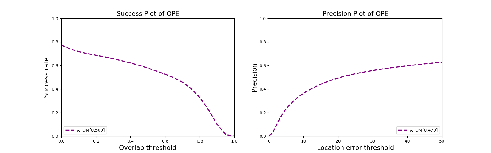

# eval_tracker
A  python toolkit for evaluating your tracking result on datasets: 
[OTB100](http://cvlab.hanyang.ac.kr/tracker_benchmark/datasets.html), 
[LaSOT](https://cis.temple.edu/lasot/) and
[UAV123](https://uav123.org/)


## Usage

### Requirements

```
matplotlib
opencv-python
numpy
```


### Tracking results placement

Your tracking result should be placed on the ***Results*** folder, there are several subfolders corresponding to different datasets. You should name your result folder as the name of your tracker and place them to the right subfolder.

```shell
|――Results
	|――OTB100
		|――ATOM
			|――default_1
				|――Basketball.txt
				|――...
			|――default_2
			|――default_3
			|―― ...
		|―― ...
	|――UAV123
		|―― ...
	|――LaSOT
		|―― ...
```

As you can see above, your tracking result may have several repeated attempts (as some trackers behave differently every time, for example ***ATOM*** ). The evaluator will output the average value for these kind of trackers.


### Code modification

To run this toolkit on your working space, you will have to do a little modification on the code:

- Find the following code in ***run.py*** and replace them with the path of your datasets.

```python
#############################################
# Here to implement the path to your datasets
#############################################
UAV123_path = "/data5/maoyy/dataset/UAV123"
OTB100_path = "/data5/maoyy/dataset/OTB100"
LaSOT_path = "/data5/maoyy/dataset/LaSOT"
```


### Run

After all configurations done, you are able to run the following command to evaluate your tracking result:

```python
python run.py --dataset otb --output_path result_otb.png
```

If setup correctly, the output will look like:

Result on OTB100:



Result on UAV123:



Result on LaSOT:


